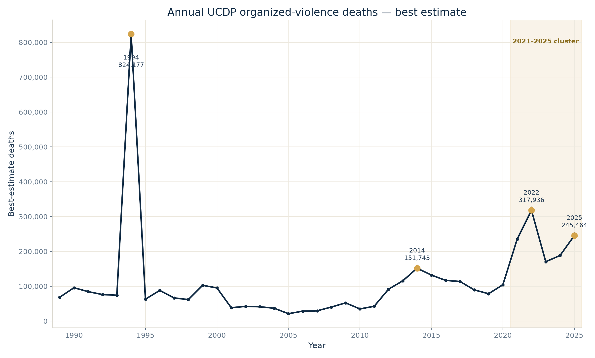
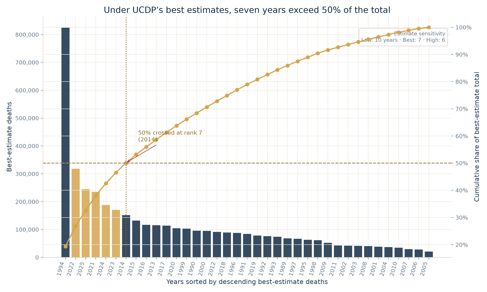
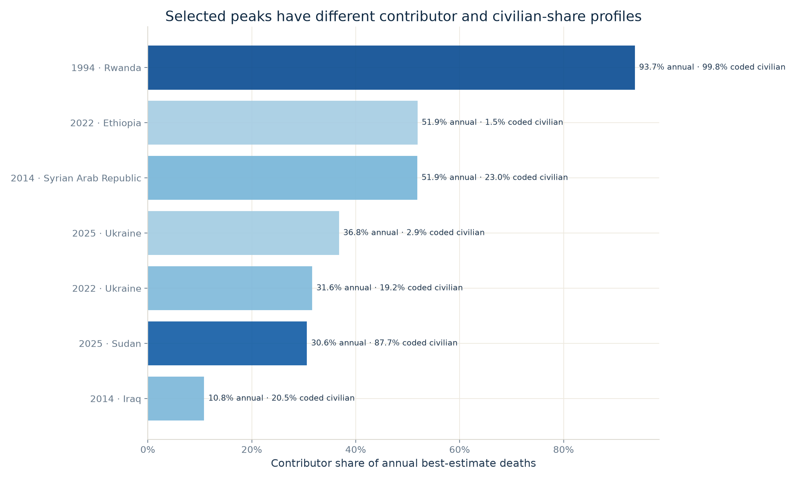
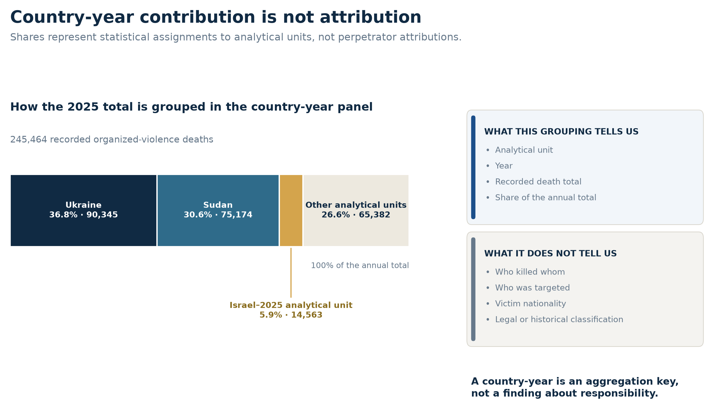
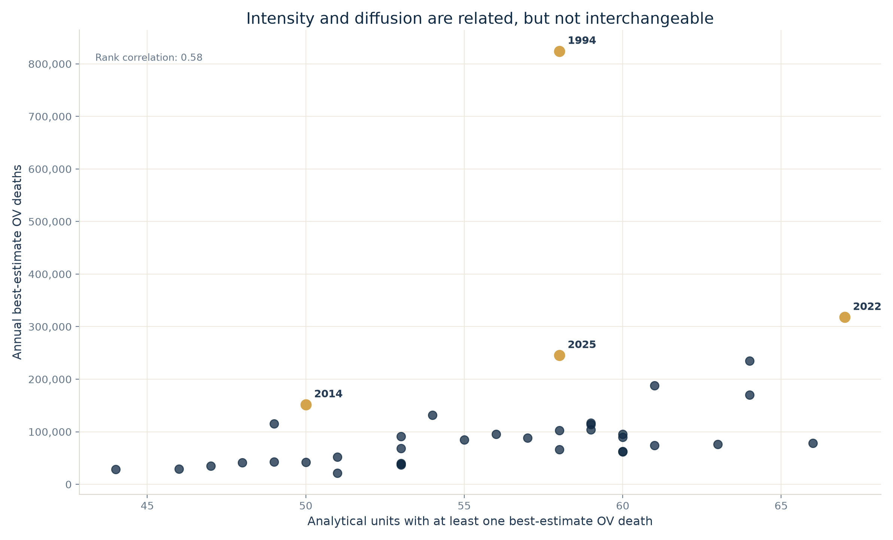

# Seven years out of thirty-seven. Half the toll.

*Under UCDP's best estimates, seven years carry half the 1989–2025 recorded total. Five of them are consecutive.*

Take the thirty-seven years between 1989 and 2025. Sort them by the number of conflict deaths recorded in each. Start adding, from the deadliest year down.

You reach half the total on the seventh year.

That is the headline, and this article is about what it does — and does not — mean. Because the seven years are not seven isolated catastrophes scattered evenly across four decades. One of them is 1994. Another is 2014. The remaining five are every single year from 2021 to 2025.

So the record contains two things at once: a few extraordinary shocks, and a recent run of very high years. Neither should be used to hide the other.

## First, what exactly is being counted

Before any number means anything, it is worth being clear about where it comes from — and what it leaves out.

Every figure in this article comes from the Uppsala Conflict Data Program (UCDP), which records **organized violence**: state-based conflict, non-state conflict between armed groups, and one-sided violence against civilians. For each event, UCDP publishes a low, a best and a high fatality estimate. Unless stated otherwise, the figures below use the **best** estimate.

Two limits follow, and they matter for everything that comes after.

**These are not all the deaths caused by war.** They are estimates of directly documented deaths, captured under UCDP's definitions, its source coverage and its inclusion rules. Deaths from displacement, hunger, collapsed hospitals — the indirect toll, which can exceed the direct one — are not in this dataset. "The toll," throughout this article, means the toll as measured inside that framework.

**And the clock starts in 1989**, because that is when UCDP's globally comparable record begins. It is not when modern mass violence begins. Everything before it sits outside every total here.

Keep both in mind. They are not fine print; they are the boundary of what any of this can say.

## The curve

Here is the annual global total, year by year.

*Annual UCDP organized-violence deaths, using the best fatality estimate. The shaded interval marks the consecutive 2021–2025 cluster.*

One year towers over everything else: **1994, at roughly 824,000 deaths.** The largest recent peaks — about 318,000 in 2022 and 245,000 in 2025 — are enormous by any standard, and still nowhere near it. A year like 2014, at roughly 152,000, looks modest only because of the company it keeps.

It is tempting to draw a single line through this and call it a trend. It is equally tempting, seeing that one spike, to say the series has no trend at all. Both readings overreach.

The defensible statement is narrower: **no single average direction summarises this curve.** It combines long-run variation, a few extreme observations, and a recent run of unusually high totals. And the years between the peaks are not quiet — the median year in this period still records around 84,400 deaths, and the lowest year on record, around 21,190.

## Seven years — but seven is not a law of nature

Sort the thirty-seven annual totals from highest to lowest, and add them up from the top. The running total crosses 50% at the seventh year:

**1994, 2022, 2025, 2021, 2024, 2023 and 2014.**

Together, roughly 2.13 million of the 4.26 million best-estimate deaths recorded across the period — 50.1%.

*Under the best estimates, the cumulative share crosses 50% at the seventh year. The exact cutoff is estimate-dependent: ten years under the low estimates, six under the high estimates.*

**How to read this chart:** each bar is one year, tallest on the left. The rising line is the running share of the total. Where that line crosses the halfway mark is the number in the title.

Now, the honest part. That crossing point moves depending on which UCDP estimate you use:

- under the **low** estimates, it takes **10 years** to reach half;
- under the **best** estimates, **7 years**;
- under the **high** estimates, **6 years**.

Seven is a real result, not an arbitrary one — but it is a result *under a specific estimate*, not a fixed property of history. What survives across all three: **a small minority of years carries a large share of the recorded total.** That is the finding. The precise integer is a detail of measurement.

The recent cluster survives too. Those five consecutive years, 2021 to 2025, account for **27.2%** of the entire thirty-seven-year total on their own. Whatever else the series is doing, it is not doing nothing lately.

## Zooming in: the unit-year

To go further, the data has to be cut more finely — and that requires one piece of vocabulary. It is the only one you need.

> **A unit-year is one place, in one year.**
>
> Ukraine in 2022 is a unit-year. Ukraine in 2023 is a different one. Rwanda in 1994 is a third. Every death UCDP records lands in exactly one of these boxes.
>
> ConflictLens calls it a *unit*-year rather than a *country*-year for a boring but necessary reason: a few analytical units in the data do not map cleanly onto a sovereign country. Treating the box as "a place, in a year" is the right instinct.
>
> A unit-year only counts in the analysis below if the unit actually **existed** that year — no phantom rows for countries before they came into being. That leaves **9,068** unit-years across the period. Of those, **2,067** recorded at least one death.

That second number is worth sitting with for a moment. Of the 9,068 existence-checked unit-years, 2,067 record at least one death, 5,067 record zero, and 1,934 have no value for this measure. In other words, just over half are observed zeros; missing values must not be treated as evidence that no violence occurred.

## Concentration gets sharper at this grain

Rank only the 2,067 unit-years that recorded at least one death — call it the **positive distribution** — and add them from the top, exactly as we did with the years.

**Twenty-two unit-years are enough to pass half of all recorded deaths.**

Twenty-two out of 2,067 positive boxes: about 1.06% of them. Out of all 9,068 existence-checked boxes: 0.24%.

Among those 2,067 positive unit-years:

- the top 1% carries **49.8%** of best-estimate deaths;
- the top 5% carries **71.9%**;
- the top 10% carries **81.9%**.

The same uncertainty caveat applies here: it takes 30 unit-years under the low estimates, 22 under the best, and 17 under the high.

Civilian deaths concentrate harder still. Among the 1,730 unit-years with at least one coded civilian death, the top 1% accounts for **69.5%** of the total civilian-death estimate.

**What this does not mean.** It does not mean violence is rare, or that most of the world is at peace, or that a zero and a missing value are the same thing. It is a statement about how a recorded total accumulates across the boxes that have something in them. Nothing more.

## The same size, different shapes

A tall bar on the annual curve tells you how much. It tells you nothing about what.

The large contributors to peak years do not look alike once you open them: they differ in how much of their year they carry, in how much of their own total is coded as civilian, and in what kinds of events UCDP recorded.

| Selected contributor | Share of annual best-estimate deaths | Coded civilian share within the contributor |
|---|---:|---:|
| Rwanda — 1994 | 93.7% | 99.8% |
| Syrian Arab Republic — 2014 | 51.9% | 23.0% |
| Ethiopia — 2022 | 51.9% | 1.5% |
| Ukraine — 2022 | 31.6% | 19.2% |
| Ukraine — 2025 | 36.8% | 2.9% |
| Sudan — 2025 | 30.6% | 87.7% |

*Bar length shows contribution to the annual total. Colour shows the coded civilian share within that contributor. Neither is a ranking of severity, responsibility or moral weight.*

Read the two columns separately. The first says how much of a year's total sits in that box. The second says how much of *that box's own* toll is coded as civilian deaths — and note "coded": the remainder is not simply "combatants," it also contains deaths whose status the source could not establish.

The contrasts are visible in the measurements. Rwanda dominates both the 1994 annual total and its civilian-death estimate. In 2022, Ethiopia and Ukraine together carry more than four fifths of the year — with very different civilian shares. In 2025, Ukraine and Sudan contribute similarly large totals while their recorded civilian profiles sit near opposite ends of these selected cases.

Event composition adds another layer. Rwanda-1994 is overwhelmingly one-sided by event count. Syria-2014 mixes a state-based majority with non-state and one-sided events. Ukraine-2025 is almost entirely state-based; Sudan-2025 combines a state-based majority with a substantial one-sided component.

And here the panel stops. These recorded profiles do not, on their own, establish that one case is a genocide, another a civil war, another an interstate war. Those are historical and legal classifications, and they require actor-level, conflict-level and contextual evidence that an aggregate panel does not contain. What the panel can do is show that the shapes differ, and say where a closer look is warranted.

## Contributing is not perpetrating

One convention holds up every country-level number above, and it needs stating plainly:

**A unit-year contributor is not a perpetrator. A share of an annual total is not a verdict.**

The panel groups deaths by place and year. That tells you where a value enters the arithmetic after the project's source mapping. It says nothing about who killed whom, who was targeted, the nationality of the victims, or the correct legal and historical name for what happened.

*The 2025 total grouped by analytical unit. Shares are statistical contributions to the panel total, not perpetrator attributions.*

The row labelled **Israel–2025 analytical unit** makes that boundary concrete. It carries a best estimate of 14,563 organized-violence deaths — 5.9% of the 2025 global total, the third-largest statistical contribution that year.

That sentence is arithmetic, and arithmetic is all it is. It does not attribute those deaths to the Israeli state, to any other actor, or to any category of victim. The same restriction applies without exception to Ukraine, to Sudan, and to every other unit-year in this article.

## Deadly is not the same as widespread

One last distinction, because the annual curve invites a specific confusion.

**Intensity** is how many deaths a year records. **Diffusion** is how many places record any at all. They are different questions, and the data answers them differently: annual best-estimate deaths range from about 21,000 to 824,000 — a factor of nearly forty — while the number of units recording at least one death moves only between 44 and 67.

*Intensity and diffusion have a moderate positive rank association of about 0.58. A year can nevertheless occupy very different positions on the two axes.*

They are not unrelated. Across the thirty-seven years their rank association is positive and moderate, about 0.58 — deadlier years do tend to be somewhat wider years. But neither one determines the other.

The 1994 maximum involves 58 units and is dominated by a single one. The widest year on this measure is 2022, at 67 units — and it is also the second-deadliest. But 2019 reaches 66 units while its total, around 78,500 deaths, sits close to the period median.

So the conclusion is not that the two axes are independent. It is that **a global death total cannot, by itself, tell you how widely violence is spread** — and a wide year is not automatically a deadly one.

## Two structures, not one

The curve is real. So is the concentration underneath it. Concentration does not cancel the temporal pattern, and the pattern does not dissolve the concentration.

Under UCDP's best estimates, seven years carry half of the measured 1989–2025 total — six or ten, depending on which estimate you trust. One extraordinary year, 1994, dominates the whole window. And five consecutive recent years sit inside that same seven-year set.

Look below the annual totals and a second distinction appears: peaks of similar height can be assembled from very different things. A country-year panel can expose that difference and point to where the interesting question is. It cannot answer the question. That still takes the actor-level, event-level and historical work that no aggregate replaces.

Which is the point of the headline. Not to compress four decades into seven bars, but to show why the global total has to be opened before it can be read.

## Sources

- UCDP (Uppsala Conflict Data Program, Uppsala University) — *<https://ucdp.uu.se/downloads/>*.
  - UCDP Country-Year Dataset on Organized Violence within Country Borders, v26.1 — annual low, best and high estimates and country-year definitions.
  - UCDP Georeferenced Event Dataset, v26.1 — event-level fatality estimates and event-type composition.
- UCDP OrganizedViolenceCY v26.1 codebook — *<https://ucdp.uu.se/downloads/organizedviolencecy/UCDP_OrganizedViolenceCY_Codebook_261.pdf>*.
- The calculations in this article use UCDP data only. ACLED, V-Dem and WDI remain part of the wider ConflictLens analytical panel but are not used for the findings above.

## Analysis notebooks

**Repo**  
[*ConflictLens repository*](https://github.com/llafon-analytics/conflictlens)

**Notebooks**  
[*Country-year analysis*](https://github.com/llafon-analytics/conflictlens/blob/master/notebooks/core/03_conflictlens_country_year_analysis.ipynb) — builds and validates the country-year analytical framework, including concentration, attribution and sensitivity diagnostics.
[*Reproduction notebook — Seven years out of thirty-seven*](https://github.com/llafon-analytics/conflictlens/blob/master/notebooks/articles/01_seven_years_out_of_thirty_seven.ipynb) — recomputes every figure, statistic and annotation used above, tests low / best / high estimate sensitivity, and asserts the revised results.
