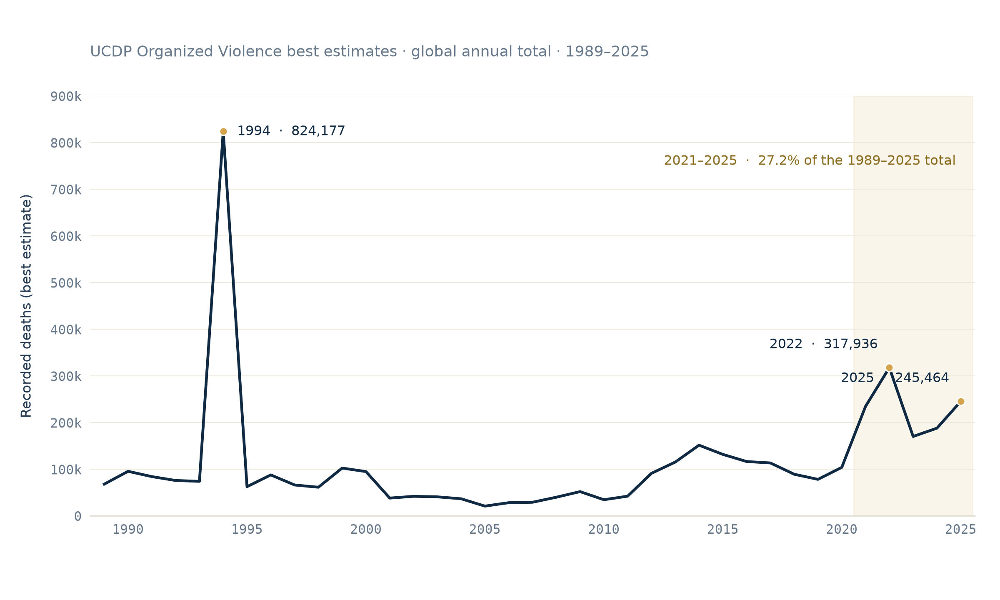

# The line has risen again. But not everywhere.

*Recent organized-violence deaths are unusually high. A small number of country-year contributors carry most of each annual total.*

Look at the far right of the curve.

*Annual UCDP organized-violence deaths, best estimates, 1989–2025. The 2021–2025 sequence accounts for 27.2% of the period total, but annual values rise, fall and rise again rather than forming a smooth global trend.*

The last five years are not merely high. Between 2021 and 2025, UCDP records roughly 1.16 million organized-violence deaths — **27.2% of everything recorded between 1989 and 2025, compressed into five years out of thirty-seven.** All five rank among the six highest annual totals in the series. Only 1994 sits above them.

Here is a useful way to feel that. Slide a five-year window across the whole period and add up each one. The 2021–2025 window is the highest of them all — but it beats 1990–1994 by 2,358 deaths, about 0.2%. Exceptional, then, and yet not without precedent. The record has been here before.

Those are descriptive facts. What follows is an argument about how to read them — because a line like this is easy to see, and easy to misread.

## What the curve is, exactly

Every figure here comes from the Uppsala Conflict Data Program (UCDP), which records **organized violence**: fighting involving a state, fighting between armed groups, and armed force used against civilians. Each year's dot on the chart above is the worldwide sum of those recorded deaths, using UCDP's central ("best") estimate.

The series starts in 1989 because that is where UCDP's global coverage starts — not because organized violence did.

Two things are visible at once, and it is worth taking them in order.

**The recent elevation is real.** About 235,000 deaths in 2021, nearly 318,000 in 2022, a fall to roughly 170,000 in 2023, then a climb through 2024 to about 245,000 in 2025.

**And 1994 still dwarfs it.** That single year — 824,177 deaths — remains far above everything else on the page. A reminder of what this scale can hold.

Now look again at the shape of the recent stretch. It rises, falls, and rises again. It is elevated. It is not a smooth, steady global increase — and the phrase "the line is rising" quietly implies one. The line has risen *again*, since 2023. That is the accurate version, and this article will keep to it.

Which leaves the more interesting problem. The line is a **sum**. A sum tells you the size of a total. It never tells you how that total was assembled — and that is where the real story of the last five years is hiding.

## Opening the total

To see the assembly, we need one piece of vocabulary. Just one.

> **A country-year is one place, in one year.**
>
> Ukraine in 2022 is a country-year. Ukraine in 2023 is a different one. Sudan in 2025 is a third. Every death UCDP records lands in exactly one of these boxes, and every global number on the chart above is simply the sum of the boxes for that year.
>
> That is all a country-year is: a container for arithmetic. It is *not* a claim about who did what.

So: sort each recent year's boxes from largest to smallest, and take just the top two.

| Year | Total deaths | Leading country-year contributors | Combined share |
|---:|---:|---|---:|
| 2021 | 235,007 | Ethiopia + Afghanistan | 70.6% |
| 2022 | 317,936 | Ethiopia + Ukraine | 83.5% |
| 2023 | 170,432 | Ukraine + Israel | 61.0% |
| 2024 | 188,209 | Ukraine + Israel | 60.3% |
| 2025 | 245,464 | Ukraine + Sudan | 67.4% |

Two boxes. Out of hundreds. And in every recent year they hold the majority of the worldwide total — in 2022, more than eight deaths in ten.

The leading country-years change from year to year, and the degree of concentration varies, from 60.3% to 83.5%. But top-two dominance holds across all five recent years.

**A caution about what that table proves.** It describes the **level** of each annual total — where the deaths *are*. It does not, by itself, identify which country-years produced the **change** from one year to the next. Those are different questions, and they need different arithmetic. Concentration in a total is not the same as concentration in its movement.

## Rising globally, unchanged almost everywhere

So let us ask the change question directly.

Between 2024 and 2025, among the 196 analytical units with comparable UCDP values, the best-estimate toll **increases in 32, decreases in 33, and stays unchanged in 131.**

Read that line twice. The worldwide total went up. Roughly as many places went down as went up. The overwhelming majority did not move at all.

"The global total has risen" and "recorded violence is rising everywhere" are therefore not the same statement. Only the first is supported here.

One boundary belongs with that count, and it matters. An unchanged **zero** means zero deaths recorded *under UCDP's inclusion rules* — the dataset applies thresholds, and lethal violence below them may not appear at all. Zero in this table is a statement about the record, not a certificate of peace. And a further 53 panel units have no value for this measure at all; a missing value is not a zero, and treating it as one would invent evidence that does not exist.

While we are drawing boundaries, here is the one that governs every named country in this article:

> Deaths are grouped under an analytical unit and a year. That grouping tells you **where a number enters the arithmetic**. It does not identify the perpetrator, the victim, or the legal and historical character of the violence. **A country-year contribution is a statistical contribution, not an attribution of responsibility.**

## The same rise, a different composition

There is a second thing a total conceals: what it is made of.

UCDP sorts organized violence into three categories, which add up without double-counting:

- **State-based** — a government is one of the armed parties.
- **Non-state** — organized groups fight each other, no state involved.
- **One-sided** — armed force used by a government or an organized group against civilians.

These are coding categories, not a ladder of severity. They describe the *form* in which violence is recorded. And one-sided violence is not a count of every civilian death: civilians are killed in state-based and non-state violence too.

*Annual UCDP organized-violence deaths by category, best estimates, 2010–2025. Between 2024 and 2025, the total rises by 57,255, while one-sided deaths rise by 62,026; state-based and non-state deaths both decline slightly in the best-estimate series.*

From 2021 to 2024, more than four-fifths of each high annual total is state-based. In 2022, that one category accounts for nearly 90% of all recorded organized-violence deaths.

In 2025, the mix of the worldwide aggregate changes. In UCDP's best-estimate series:

- state-based deaths stay the largest component but dip slightly, from 155,255 to 153,782;
- non-state deaths fall too;
- one-sided violence rises from 14,720 recorded deaths in 2024 to 76,746 in 2025.

Now put the arithmetic side by side. The overall total gains **57,255** deaths. One-sided violence alone gains **62,026** — *more* than the net increase, because the other two categories subtract from it.

Three things need saying immediately, before that number can be misread.

**First, this is not a broad shift across the world.** Sudan accounts for 62,775 of the 76,746 one-sided deaths in the 2025 best estimate, and for about 97.5% of the worldwide increase in that category since 2024. What changed is the composition of a global aggregate — driven, in the arithmetic, by essentially one country-year. That is not the same as conflicts everywhere changing character. (And once more: naming the box says where the deaths enter the sum. It assigns nothing.)

**Second, one-sided violence does not become the majority of 2025.** State-based deaths still represent 62.6% of that year's total. One-sided violence explains the *increase*; it does not take over the *year*.

**Third, the estimates matter.** UCDP publishes a low, a best and a high figure — not formal confidence intervals, but an honest range reflecting how much the underlying documentation can vary. The one-sided rise holds up: it stays positive even when the cautious 2025 estimate is compared against the generous 2024 one. The small state-based *decline*, however, does not survive that test — under the low and high variants it turns into an increase. So it must be read as a feature of the best-estimate series, not as a fact about the world.

Which leaves one last, deeper caveat, and it applies to everything above. This is a statement about what is **recorded**. A change in the record can come from a change on the ground, a change in what gets documented, or both — and a country-year sum cannot separate those possibilities. It can tell us that the aggregate mix moved, where the arithmetic is concentrated, and by how much. It cannot tell us why.

## The line cannot explain the line

The annual curve can establish that recent best-estimate totals are unusually high. On its own, it cannot say why.

It contains death estimates, coding categories, analytical units and years. It does not contain diplomatic decisions, military strategy, foreign intervention, institutional collapse, or the histories of the conflicts underneath the sum. No amount of staring at it will produce those.

So the safe conclusion is a narrow one — and worth stating in full:

> Using UCDP's best estimates, 2021–2025 forms an unusually high sequence, but the increase is not a uniform global wave. Each annual total is concentrated in a small number of country-year contributors. The 2024–2025 rise is accounted for by the one-sided category and, within that category, overwhelmingly by one country-year. These are changes in a global aggregate — not evidence of a common trajectory across countries or conflicts.

The curve identifies the phenomenon. Understanding it means leaving the curve behind.

## Where to look closer

For the first view of how recorded deaths concentrate across years and country-years, see [*Seven years out of thirty-seven. Half the toll.*](/seven-years-out-of-thirty-seven/)

For the definitions used above, UCDP publishes its [*category definitions*](https://www.uu.se/en/department/peace-and-conflict-research/research/ucdp/ucdp-definitions) and its [*coding methodology*](https://www.uu.se/en/department/peace-and-conflict-research/research/ucdp/ucdp-methodology) in full. They are short, readable, and repay the ten minutes.

The closest external companion to this analysis is PRIO's [*Conflict Trends: A Global Overview, 1946–2025*](https://www.prio.org/publications/14802), which uses UCDP data to examine the recent rise in conflicts, fatalities, interstate confrontations and violence against civilians. PRIO also published a recorded discussion, [*Global conflict data release: A dangerous resurgence of war*](https://www.prio.org/events/9296), for readers who prefer a video overview.

For a broader and more interactive perspective, [*Our World in Data's War and Peace*](https://ourworldindata.org/war-and-peace) shows how a small number of exceptionally lethal wars can bend the apparent global trend.

The annual line is worth showing. But it is the beginning of the question, not the answer.

## Sources

- UCDP (Uppsala Conflict Data Program, Uppsala University) — *<https://ucdp.uu.se/>*. The article uses the UCDP Organized Violence dataset, v26.1, aggregated through the validated ConflictLens country-year panel.
- PRIO — [*Conflict Trends: A Global Overview, 1946–2025*](https://www.prio.org/publications/14802).
- PRIO — [*Global conflict data release: A dangerous resurgence of war*](https://www.prio.org/events/9296).
- Our World in Data — [*War and Peace*](https://ourworldindata.org/war-and-peace).

## Analysis notebooks

**Repo**

[*ConflictLens repository*](https://github.com/llafon-analytics/conflictlens)

**Notebooks**

[*Country-year analysis*](https://github.com/llafon-analytics/conflictlens/blob/master/notebooks/core/03_conflictlens_country_year_analysis.ipynb) — validates the country-year analytical framework and provides the source results reused here.

[*Reproduction notebook — The line has risen again. But not everywhere.*](https://github.com/llafon-analytics/conflictlens/blob/master/notebooks/articles/03_the_line_is_rising_but_not_everywhere.ipynb) — recomputes every article-facing number, exports the two figures and the summary table, tests the low/best/high sensitivity boundaries, and asserts the validated results (59/59 checks).
