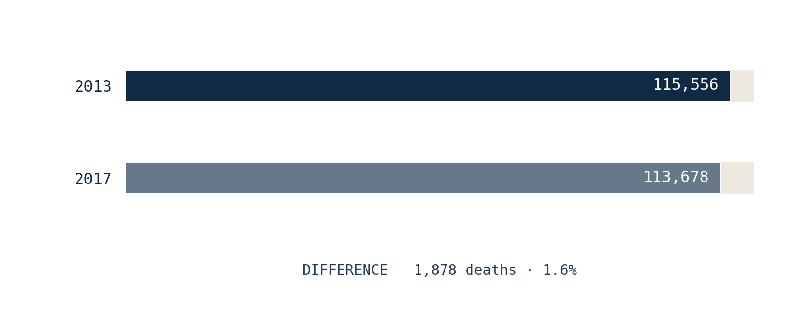
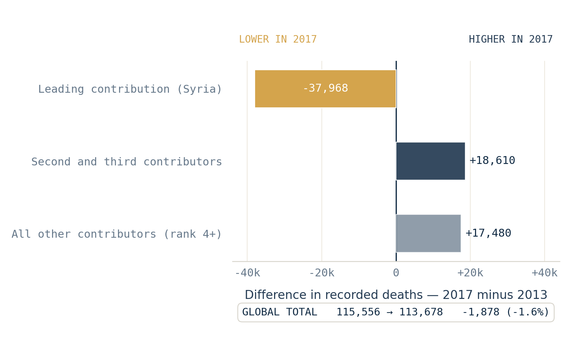

# Two years, almost the same toll. Not the same shape.

*Two years, 1.6% apart in total. In 2013, one country-year held two-thirds of it; in 2017, only a third — while the smaller contributors held 66% more deaths.*

*Worldwide best-estimate totals of organized-violence deaths. The bars share a zero baseline: 115,556 in 2013 and 113,678 in 2017, only 1,878 deaths — 1.6% — apart.*

On the annual curve, the two years sit at almost exactly the same height. What sits underneath them does not.

A tall bar tells you how large a year's total is. It does not tell you how that total was assembled — how many places carried it, or whether one place carried most of it. Usually, in this dataset, the two travel together: a big year tends to be a concentrated year. 2013 and 2017 are where that expectation breaks.

## First, one piece of vocabulary

To open a total, we need one word. Just one.

> **A country-year is one place, in one year.**
>
> Syria in 2013 is a country-year. Syria in 2017 is a different one. Every death UCDP records lands in exactly one of these boxes, and each year's worldwide total is simply the sum of that year's boxes.
>
> *(ConflictLens's underlying grain is the* analytical unit*; for the years compared here it is a country, and nothing below depends on the distinction.)*

The largest box's share of the total gives a simple measure of concentration: how top-heavy the year is.

## What a total normally tells you

Across 1989–2025, deadlier years tend to be more concentrated: the more deaths a year records, the larger the share carried by its single biggest country-year. It is a tendency, not a rule — but a strong one, and there are two ways to feel how strong. As a plain count: of the ten deadliest years since 1989, seven are also among the ten most concentrated. And as a single score for a rising link — where 0 means no monotonic link and 1 means perfect lockstep — the tendency comes out at 0.82. The figure below places that 0.82 between those extremes; it holds even without 1994, the largest and most concentrated year on record. Part of the link is arithmetic, since the biggest box is itself part of the total. But the pattern is real: a high total is informative about concentration. It is not a reconstruction of the distribution beneath it.

![Calibration strip with four scatter panels. Each dot is a year, plotting the rank of its yearly total horizontally against the rank of its concentration vertically. A diagonal reference line in each panel shows perfect agreement. From left to right: weak (rho equals 0.20, points scattered widely), moderate (rho equals 0.50, points begin to cluster along the diagonal), strong (rho equals 0.82, real data in amber, points rise together with visible exceptions), and perfect (rho equals 1.00, points lie exactly on the diagonal).](../figures/two-years-almost-the-same-toll/fig02a_association_calibration.png)

*How strong is 0.82? Four patterns of association, from none to perfect. Each dot is a year; the closer the cloud hugs the rising diagonal, the stronger the link. Our 37 years sit at 0.82 — clearly rising together, with visible exceptions. The three grey panels are illustrative references; only the amber 0.82 panel is real data. In each panel: → higher total   ↑ more concentrated.*

Here is that relationship, one dot per year.

*Annual total against leading-contributor share, 1989–2025 (log scale). The general association is strong — Spearman's rho is 0.82 — while 2013 and 2017 expose the variation it cannot explain. The 1990–2000 control nearly overlaps.*

**How to read this.** Each dot is one year. Left-to-right is how deadly the year was — the horizontal scale is stretched at the low end (log scale) so the quieter years don't pile up. Up-down is the share held by the single largest country-year. The cloud tilts upward: deadlier years tend to be more concentrated. Now find the two labelled pairs. **1990 and 2000** land almost on top of each other — the rule holds. **2013 and 2017** sit at the same left-right position, meaning nearly the same total, but far apart top-to-bottom.

That vertical gap is the point of this article. The rule predicts most of the picture; these two years are where it predicts *worst*. Same volume, opposite concentration — and the difference is exactly what a total cannot tell you.

## Two years that follow the rule

Start with the pair that behaves. Across the whole series, the two closest years by total are 1990 and 2000.

Their totals differ by 0.61% — 95,752 against 95,168 — and their ranked profiles are very similar. Ethiopia leads both, at 52.1% and 51.1%; the top three carry 62.7% and 61.4%. The identities below the first rank differ, so the resemblance is about concentration, not geography. Two years, nearly the same size, assembled in nearly the same shape. This is what the rule expects.

## Two years that do not

*Left: 1990 and 2000, totals 0.61% apart and ranked concentration profiles very similar. Right: 2013 and 2017, totals 1.6% apart and the widest concentration contrast among the thirteen pairs below the 3% threshold. Labels report the leading share, the rank-four-and-below share, the top-three share and the effective number of contributors. These are statistical contributions, not attributions of responsibility.*

**How to read this.** Each bar is one year's total, all on the same scale. It is split into the largest country-year (the bottom block), the next two, and everything from the fourth down. Watch the bottom block shrink from 2013 to 2017 while the blocks above it grow.

Now the pair that breaks the rule. In 2013, the **Syria country-year contributes 66.2%** of the worldwide total; the top three reach 77.1%. In 2017, Syria still leads, but at **33.9%**, while the top three reach 61.4%.

The label at the end of each bar — the *effective number of contributors* — rises from **2.2 to 5.9**. Read it as a question: if the total were split into equal shares, how many equal contributors would produce this much concentration? In 2013, barely more than two. In 2017, closer to six. Same height on the curve; not the same statistical object.

One caution the label cannot carry: the unchanged country name does not mean an unchanged conflict. Each country-year can combine several dyads and several categories of organized violence. Syria in 2013 and Syria in 2017 are the same box, not the same situation.

## The difference is not where you would look for it

*Difference in recorded deaths, 2017 minus 2013. Left means lower in 2017; right means higher. The bars compare two best-estimate endpoint distributions and do not represent flows.*

**How to read this.** Each bar is a difference: 2017 minus 2013. Left of the centre line means lower in 2017; right means higher. The three component bars add up to the short total bar at the bottom.

Here is why the totals ended up so close. The leading contribution is **37,968 lower** in 2017 — a very large fall. But it is almost entirely offset elsewhere: the second and third contributors are **18,610 higher**, and the contributors ranked fourth and below are **17,480 higher**. Together, those rises come to 36,090 deaths.

Read that again: a fall of nearly **38,000** at the top of the distribution, and the worldwide total moves by under **2,000**.

The smaller contributors do much of that work. Their combined toll rises from 26,445 to 43,925 deaths — **66% more**. A steep drop at the top, a broad rise underneath, and the two totals land within 1,878 of each other. The same sum, reached by two very different arrangements.

## Why the shape is worth measuring on its own

The departures on the map earlier are not a curiosity; they carry a practical warning. When one country-year holds two thirds of a year's total, that year rests on a single component — and a later revision to that one component would move the whole total. A more distributed year is not error-proof, but it does not hang on one entry in the same way. Volume and shape are different properties, and a total reports only the first.

## What this comparison does not claim

This is a comparison of statistical structures, not an equivalence between histories.

- The measures use UCDP's best estimates; the lower and upper estimates are not carried through. The 1,878-death gap is therefore not a precisely measured historical difference.
- A country-year share identifies neither a perpetrator, a victim group nor legal responsibility. It may combine several categories of organized violence.
- The pair is chosen, not random — but chosen for *shape*, not for *cast*. Among the thirteen pairs whose totals differ by less than 3%, 2013–2017 ranks first on five concentration contrasts: leading share, the HHI (a standard concentration index — the mathematical inverse of the effective count used above), effective contributors, top-three share and the complete ranked profile. Measured instead by how much the contributing countries themselves changed, it ranks only ninth. The claim is about the change in shape, not the maximum change in geography. The concentration result also holds at the 2% and 5% thresholds.

The finding is deliberately narrow:

> A high annual total is usually associated with a concentrated year. It does not determine one. Two years can record almost the same global best estimate and allocate it very differently across ranked country-year contributions.

## A total is only the first compression

An annual total compresses the fifty to sixty country-years that record at least one death in a given year into a single number. It keeps volume and discards shape. Concentration can often be anticipated from volume, but not recovered from it.

If two totals separated by 1.6% can conceal distributions this different, the next compression deserves the same scrutiny:

Can a single average describe the thousands of country-years underneath it?

## Where to look closer

This is the third view of how recorded deaths concentrate. For the first — how a handful of years carry half the period's total — see [*Seven years out of thirty-seven. Half the toll.*](/seven-years-out-of-thirty-seven-half-the-toll/). For how the recent annual totals concentrate in a few country-year contributors, see [*The line is rising. But not everywhere.*](/the-line-is-rising-but-not-everywhere/).

The question this article ends on — whether a single average can stand in for the country-years beneath it — is the subject of the next piece in the series, *Anatomy of concentration*.

## Sources

- UCDP (Uppsala Conflict Data Program, Uppsala University) — *<https://ucdp.uu.se/>*. The article uses UCDP Organized Violence, v26.1, aggregated through the validated ConflictLens analysis-unit-year panel (`analysis_conflict_universe`, unit-existence guard applied).
- The analysis covers 1989–2025, the period of UCDP's global event-level coverage used in the panel.

## Analysis notebooks

**Repo**

[*ConflictLens repository*](https://github.com/llafon-analytics/conflictlens)

**Notebooks**

[*Country-year analysis*](https://github.com/llafon-analytics/conflictlens/blob/master/notebooks/core/03_conflictlens_country_year_analysis.ipynb) — builds and validates the country-year analytical framework and provides the source panel used here.

[*Reproduction notebook — Two years, almost the same toll. Not the same shape.*](https://github.com/llafon-analytics/conflictlens/blob/master/notebooks/articles/01b_two_years_almost_the_same_toll.ipynb) — recomputes every article-facing number, scans all year-pairs under the volume threshold, validates the pair selection across several concentration metrics, exports the five figures and asserts the final results.
