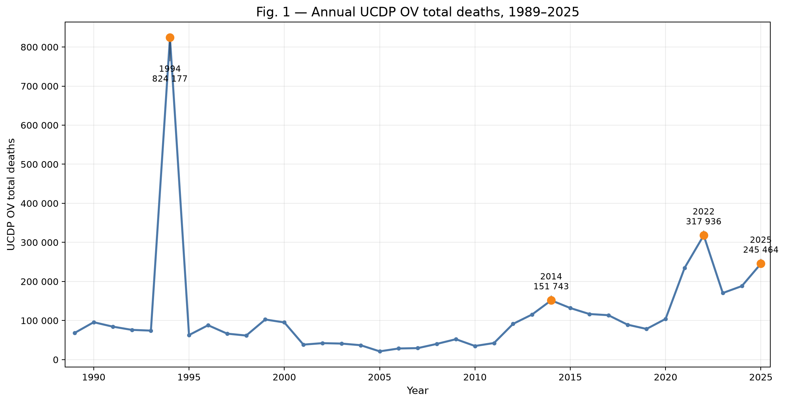
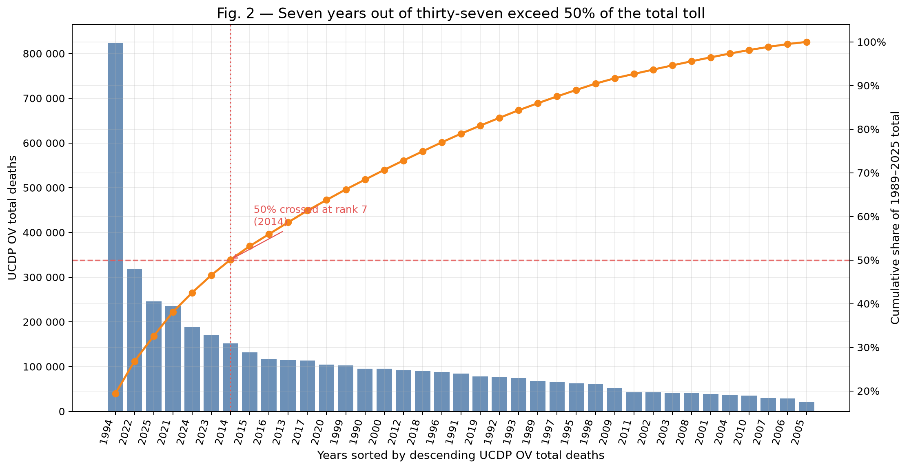
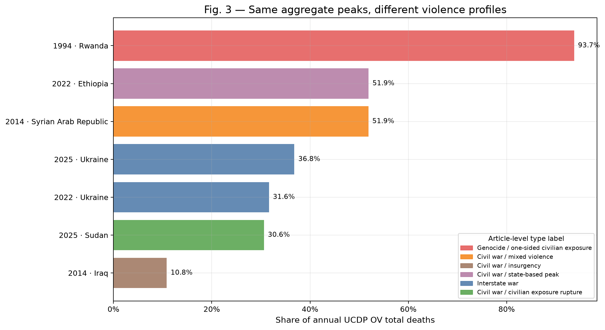
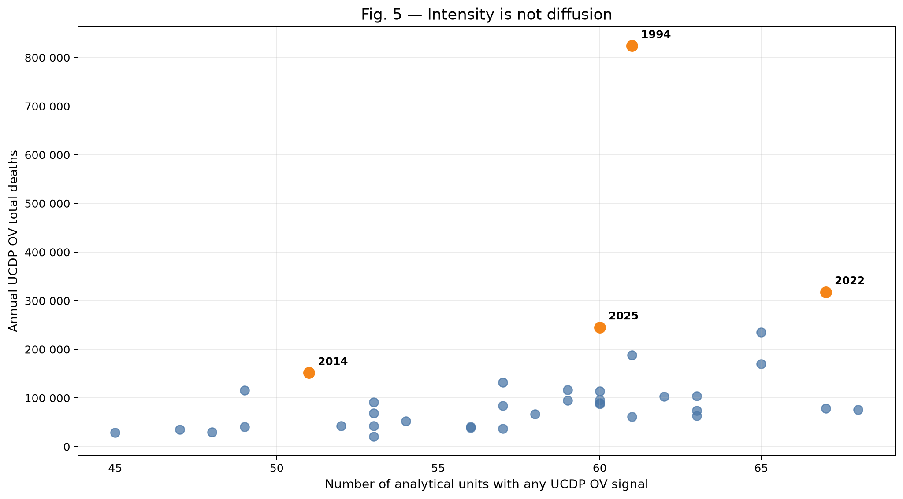

# Seven years out of thirty-seven. Half the toll.

*A handful of years carry almost everything — and each one is a different kind of catastrophe.*

Seven years. Out of thirty-seven. That's all it takes to reach half of every conflict death recorded since 1989.

Not the deadliest decade. Not a region, or a war, or a cause. Seven individual years, scattered across nearly four decades, together account for roughly half of the entire toll. The other thirty carry the rest between them.

A line chart invites you to read a trend: violence rising, falling, recovering, rising again. It's a natural reflex, and for most data it's the right one. Conflict violence doesn't behave like that. It behaves like a small number of earthquakes on an otherwise quiet seismograph — long stretches where the needle barely moves, broken by a handful of years that tear off the top of the page.

This article is about that shape, and about what it means to look inside it. Because once you see that the toll concentrates rather than spreads, a second thing becomes visible: the years that carry it are not the same kind of event at all.

## A curve that looks like a trend

Start with the simplest possible view: total conflict deaths per year, worldwide, from 1989 to 2025. This is the UCDP measure of organized violence — deaths recorded across state-based conflict, non-state conflict, and one-sided violence against civilians.

*Annual UCDP organized-violence total deaths, 1989–2025. The 1994 peak is left at full height on purpose — the spike is the argument.*

One year towers over everything else: 1994, at roughly 820,000 deaths. Nothing in the rest of the series comes close. The largest recent peaks — around 318,000 in 2022 and around 245,000 in 2025 — are enormous in absolute terms, and still they sit far below 1994. A mid-scale year like 2014, around 150,000, barely registers as a bump beside it.

A curve shaped like this is not a trend. You can draw a line through it, but the line is a fiction: it averages together a quiet year and a catastrophic one and reports something that describes neither. What the chart actually shows is a sequence of shocks of wildly unequal size, most of them small, a few of them immense.

One caveat belongs here, before any number is read too confidently. This series begins in 1989, where UCDP's event-level global coverage starts. It does not reach back to earlier mass-fatality conflicts — the killings in Cambodia in the 1970s, among others, fall entirely outside it. Nineteen eighty-nine is where these records begin, not where modern mass violence begins. Every figure in this article is a statement about what is inside this window, and nothing about what came before it.

## Seven years carry half of it

It would be easy to assume 1994 is the whole story — one freak year, and the rest a gentle background. It isn't. The concentration holds across the entire period.

Sort all thirty-seven years by their death toll and add them up from the top. You cross half of the full 1989–2025 total — roughly 2.13 million of about 4.26 million deaths — after just seven years. Those seven are 1994, 2022, 2025, 2021, 2024, 2023 and 2014. Seven years hold half; the remaining thirty hold the other half.

*The 37 years sorted from deadliest to least deadly, with the running cumulative share. The line crosses 50% at the seventh year.*

The same finding, seen at a finer grain, is even starker. Instead of keeping each year whole, split it by country — so 1994 becomes Rwanda-1994, Afghanistan-1994, and so on, each a single country-year. Rank those. Now only about twenty-two individual country-years are needed to reach the same half of the total. Roughly the top 1% of these country-years carries about half of all deaths; the top 5%, about 72%; the top 10%, about 82%. The vast majority of country-years contribute almost nothing to the sum.

For civilian deaths specifically, the concentration is sharper still: the top 1% of country-years with civilian deaths accounts for around 70% of every civilian death in the panel.

None of this says violence is rare, or fading, or contained. It says the toll is not evenly distributed in time — it piles up in a few places and a few years, and the aggregate curve is mostly built from them.

## The same bar, four different catastrophes

Here is where the concentration stops being a statistical curiosity and becomes the point of the whole project. The years that carry the toll are not interchangeable. They are not larger and smaller versions of one thing. They are different kinds of event that happen to produce similar-looking totals.

Take the four peaks the curve annotates, and look at what each one is actually made of.

| Peak year | What kind of event it is | Why it doesn't match the others |
|---|---|---|
| 1994 — Rwanda | A genocide, coded as one-sided violence | Rwanda alone accounts for about 94% of the year's deaths, and about 98.5% of its civilian deaths — a campaign directed at a civilian population, not a war between armed forces. |
| 2014 — Syria | A civil war | Syria carries roughly 52% of the year's total, a concentrated internal armed conflict with many actors — not civilian-dominated in the way 1994 was. |
| 2022 — Ethiopia and Ukraine | A civil war and an interstate war, in the same year | Ethiopia (about 52%) and Ukraine (about 32%) are two structurally unrelated kinds of conflict compressed into one aggregate number. |
| 2025 — Ukraine and Sudan | An interstate war and a civilian-exposure rupture | Ukraine (about 37%, mostly non-civilian) and Sudan (about 31%) sit in the same yearly total with opposite civilian profiles — Sudan alone accounts for about 72% of the year's civilian deaths. |

*The leading contributor to each peak year, labelled by the kind of violence it represents. Bar length reflects each unit's share of that year's total deaths — not the severity, gravity, or moral weight of the events. A longer bar means a larger share of one year's arithmetic, nothing more.*

That caption matters, so it is worth saying plainly in the text as well: the chart above is not a ranking of atrocities. Genocide, civil war, interstate war and civilian-exposure rupture are used here as descriptive categories — different shapes that lethal violence can take — never as rungs on a ladder of severity. Placing Rwanda 1994 near Ukraine or Sudan 2025 on the same axis is not a claim that one is worse, more tragic, or more historically significant than another. It is a claim that they are not the same phenomenon, and that averaging them into a single "conflict deaths" trend hides exactly what makes each one what it is.

That is the sentence to hold onto: a genocide, a civil war, an interstate invasion and a civilian-exposure rupture can produce a similar-looking bar on a chart. They are not similar events.

## What this does not say — and the case that proves why

Everything above rests on one convention, and the convention deserves to be stated in the open, because it is easy to misread.

A country-year contributor is not a perpetrator. A share of annual deaths is not a verdict.

When this analysis says a country accounts for some share of a year's deaths, it means only that those deaths are statistically coded under that analytical unit and that year in the underlying data. It does not identify who did the killing, who was targeted, what nationality the victims held, or how the violence should be classified in law or in history. Those are actor-level and event-level questions, and this project does not attempt to answer them here. The country-year is a bookkeeping grain, not a finding about responsibility.

The clearest illustration of why this matters is in the most recent year in the data.

Israel is the third-largest country-year contributor to the 2025 total, at roughly 6% of that year's global organized-violence deaths — about 14,600 deaths coded under that unit and year. Naming that number without immediately attaching this caveat would be worse than not naming it at all: on its own it reads like an attribution of responsibility, and country-year data cannot support an attribution of responsibility — on this conflict least of all, where the distinction between "deaths coded under a unit" and "who killed whom" carries more weight than almost anywhere else in the dataset. The figure is a contribution to an arithmetic total. It is not a statement about perpetration, about victims, or about the character of the violence — and this article deliberately assigns it no such label. That tension is exactly why the convention exists. This is the case that makes it concrete rather than abstract.

The same discipline applies, quietly, to every row in every table above. It is simply hardest to ignore here.

## Deadliness is not spread

There is one more distinction the aggregate curve blurs, and it is worth separating before closing.

Intensity — how many people die — is not the same as diffusion — how many places are touched. They are different axes, and they don't move together.

Across the whole period, the number of analytical units recording any lethal organized violence in a given year stays inside a fairly narrow band: roughly 45 to 68 units, year after year. That range barely widens even as annual death totals swing from the low tens of thousands up to the roughly 820,000 of 1994. The deadliest year on record is not the year violence was most widely spread; it is a year whose toll was overwhelmingly concentrated in a single country.

*Each point is one year: deaths on the vertical axis, number of units with any lethal violence on the horizontal. A year can be extreme in one dimension and ordinary in the other.*

So a year can be catastrophically deadly without being the year conflict reached the most corners of the world — and a widely spread year need not be an especially deadly one. Collapsing both into a single curve loses that difference entirely.

## Where to look closer

The global curve is real. So is the concentration behind it. Both matter, and neither one is a story about trends. Together they are closer to a map — a map of where the toll actually piles up, and a warning that the piles are not the same kind of thing.

That is the whole purpose of starting a conflict-analysis project here rather than with a headline number. Data can reveal structure: it can show you that seven years hold half the toll, that a genocide and an interstate war can cast the same shadow on a chart, that intensity and spread are different measurements. What data cannot do is stand in for the historical, political, actor-level and event-level analysis that tells you what any one of these years actually was. The structure is an invitation to look closer, not a substitute for looking.

If the first lesson is that conflict deaths concentrate instead of spreading, the second is what that concentration actually looks like underneath — why a handful of extreme observations can dominate a total, and why that makes averages the wrong tool for this kind of data. That is the subject of the next article, *Anatomy of concentration*.

## Sources

- UCDP (Uppsala Conflict Data Program, Uppsala University) — <https://uu.se/en/department/peace-and-conflict-research/research/ucdp>. Two UCDP datasets underpin this article's headline figures:
  - UCDP Georeferenced Event Dataset (GED), v26.1 — event-level, the primary conflict source.
  - UCDP Organized Violence dataset, v26.1 — country-year aggregate, used for cross-checking the annual totals.
- ACLED (Armed Conflict Location & Event Data Project) — <https://acleddata.com>, used as a complementary benchmark, not as the primary conflict count.
- V-Dem (Varieties of Democracy, University of Gothenburg / V-Dem Institute) — <https://v-dem.net>, V-Dem-CY-Full+Others v16 — political and institutional context.
- WDI (World Bank, World Development Indicators) — <https://databank.worldbank.org/source/world-development-indicators> — socioeconomic context.
- The concentration and peak-year figures in this piece are computed from UCDP data only (GED + Organized Violence). ACLED, V-Dem and WDI are part of ConflictLens' wider country-year panel and are not used in this article's headline numbers.

## Analysis notebooks

TODO: update with the actual repository path before publishing.

Placeholder: <https://github.com/ludo/conflictlens>
